# 数据结构课程期末设计题

# 饭店安排桌位系统

> 张驰一 19307130043

[TOC]


## 一、需求分析

### 1.main函数：int main()

​	完成一个Restaurant类，完成APP的主要功能——安排顾客入座，并记录入座历史。

​	主函数从文件中读取数据，初始化一个Restaurant类型，模拟一个时间轴从starttime跑到endtime, 步幅暂定为1分钟，每次时间更新都对Restaurant进行更新。

### 2.时间结构：class resclock

​	为了适应这个饭店的开放时间，时间的范围都是从11:00到2:00，要求按时间格式输出，并且使得凌晨时分比白天要晚。重载输入输出流，各类逻辑符号，以及基础的加法。

### 3.顾客信息：class customer_info

存储：

1. 编号
2. 顾客人数
3. 到来时刻
4. 等待用时
5. 就餐时刻
6. 就餐用时
7. 离开时刻

输出：

​	按格式输出

### 4.Restaurant类: class Restaurant

**存储**：

1) **所有桌子的状态**；

其中，单个桌子的状态：

指示：

1. 是否可用
2. 当前用餐人信息

处理：

1. 顾客入座

2）**历史流水**；

存储：

​	今日所有的顾客信息。

3）**等待区**

存储：

​	按到来时刻排序的顾客信息数组。

4）**下一个要分配分配的**ID；


输入接口：

​	通过输入流intable和incustomer初始化餐厅内的桌位情况（n_1个1人桌位、n_2个2人桌位、…、n_s个s人桌位），以及进入的顾客的信息。

输出接口：

​	output1处理数据，输出一天中所有组顾客在饭店的平均停留时间、平均等位时间。注：一组顾客的停留时间=等位时间+就餐时间；

​	output2处理数据，输出最后一组离开饭店的顾客的离开时间；

​	output3将一天内所有组顾客的到达时刻、等位用时、就餐时刻、就餐用时、及离开时刻按格式输出，输出按照顾客编号排序。

**处理函数：**

**用餐函数**：dine()

​	如果饭店内有空位，就让等位区的顾客入座。

**更新函数**：update_table_avail()

​	根据当前时间更新所有桌子的状态。


## 二、概要设计

### 1.int main()


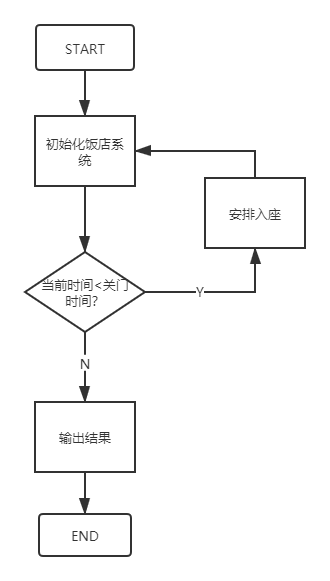

其中安排入座的函数是核心。

### 2.Class resclock

底层用int实现。

```c++
private:
	int current;
```

重载各运算符

```c++
bool operator<(const resclock& a) const;
bool operator==(const resclock& a) const;
bool operator>(const resclock& a) const;
bool operator<=(const resclock& a) const;
bool operator>=(const resclock& a) const;
resclock operator++();
resclock operator++(int);
resclock operator+=(int period);
std::ostream& operator << (std::ostream& output, resclock& c);
resclock operator + (resclock c, int period);
```

### 3. 顾客信息

```c++
private:
	int id;					//编号
	int size;				//顾客人数
	resclock arrivetime;	//到来时刻
	int waitperiod;			//等待用时
	resclock startime;		//就餐时刻
	int eatperiod;			//就餐用时
	resclock departime;		//离开时刻
```

### 4.Class Restaurant

```c++
private:
	std::vector<std::vector<table>> tables;	//tables[3][2]表示4人桌的第二号桌，记作D2
	std::vector<customer_info> bill;
	std::priority_queue<customer_info, std::vector<customer_info>, priorder> wait_section;
	int nextid;
```

用二维vector存储所有桌子的状态 tables，每个元素都是一个table类的桌子；

#### ·单个桌子的状态

```c++
private:
	customer_info dinner;
	bool avail;
```

用一维数组存储历史流水，每个元素都是一个customer_info类的顾客信息；

用优先级队列（最小堆）存储顾客等待区，每一个元素也都是customer_info。以下是排序的规则，按照到达时间来排序，如果到达时间相同，人数少的顾客组优先。

```c++
class priorder //重写仿函数
{
public:
	bool operator() (customer_info a, customer_info b)	//小顶堆
	{
		if (a.arrivetime > b.arrivetime)
			return 1;
		else if (a.arrivetime == b.arrivetime)
		{
			return a.size > b.size;
		}
		else
			return 0;
	}
};
```

下一个要分配的ID就是一个int量；

### ·核心步骤：安排入座

先简单分为两步：

第一步、更新桌子状态 void Restaurant::update_table_avail()，遍历所有table，更新avail即可。

第二步、将合适的等位区的顾客安排入座，总体流程图如下：


细化安排入座环节：

细分 (1).png)


## 三、详细设计

### 1.主函数main

#### main.cpp(去DEBUG版本)

```c++
#include<iostream>
#include<fstream>
#include<cstdlib>
#include<ctime>
#include"Restaurant.h"
using namespace std;
//#define RAND
//初始化时间
resclock starttime(11, 0);	//11点开门
resclock globaltime = starttime;	
resclock endtime(1, 30);	//2点0分关门， 1点30打烊

//今日customer数量
const int sum_customer = 300;
//随机数种子
unsigned seed = (unsigned int)time(NULL);

void randin(ostream& output)	
{
	srand(seed);
	int cus_size, res_current, eatp;
	
	for (int i = 0; i < sum_customer; i++)
	{
		cus_size = rand() % MAX_VOLUME + 1;
		res_current = 660 + rand() % 870;	//660-1529.
		resclock res(res_current);			//11:00 - 25:29.  
		eatp = rand() % 30 + 1;				//eatp <= 30.

		output << cus_size << " " << res << " "
			<< "0:" << setw(2) << setfill('0') << eatp << endl;
	}
	output << 0;
}

int main() {

#ifdef RAND
	ofstream file_writecustomer("input_customer.txt");
	randin(file_writecustomer);	//随机初始化input_customer.txt
	file_writecustomer.close();
#endif // RAND

	ifstream infiletable("input_table.txt");
	ifstream infilecustomer("input_customer.txt");
	ofstream outfiledata("output_data.txt");
	ofstream outfilecustomer("output_customer.txt");
	
	Restaurant restaurant(infiletable, infilecustomer);

	for (; globaltime <= endtime; globaltime++)
	{
		restaurant.update_table_avail();
		restaurant.dine();
	}

	restaurant.output1(outfiledata);
	restaurant.output2(outfiledata);
	restaurant.output3(outfilecustomer);
	
	infiletable.close();
	infilecustomer.close();
	outfiledata.close();
	outfilecustomer.close();

	return 0;
}

```


### 2.时间结构resclock

#### resclock.h

```c++
#pragma once
#include<iostream>
#include<iomanip>

class resclock
{
	friend std::ostream& operator << (std::ostream& output, resclock& c); //定义运算符“<<”重载函数
	friend resclock operator + (resclock c, int period);	//"+"
	friend class table;
private:
	int current;
public:
	resclock(): current(0){}
	resclock(int v) :current(v) { update(); }
	resclock(int a, int b) { current = a * 60 + b; update(); }
	void update()	//做完加减法后要记得update()
	{
		while (current < 0)
			current += 1440;
		current = current % 1440;
	}
	bool operator<(const resclock& a) const
	{ 
		//分为正常时段11:00-23:59;凌晨时段0:00-2:00
		//正常时段早于凌晨时段
		if (current >= 660 && a.current <= 120)	return 1;
		//凌晨时段晚于正常时段
		if (current <= 120 && a.current >= 660)	return 0;
		//同一时段正常比较
		return current < a.current;
	}
	bool operator==(const resclock& a) const
	{ return current == a.current;}
	bool operator>(const resclock& a) const
	{ return !operator<(a) && !operator==(a);}
	bool operator<=(const resclock& a) const
	{ return !operator>(a);}
	bool operator>=(const resclock& a) const
	{ return !operator<(a);}
	resclock operator++()
	{
		current++;
		update();
		return *this;
	}
	resclock operator++(int)
	{
		resclock temp = *this;
		current++;
		update();
		return temp;
	}
	resclock operator+=(int period)
	{
		current += period;
		update();
		return *this;
	}
};

std::ostream& operator << (std::ostream& output, resclock& c); //定义运算符“<<”重载函数
resclock operator + (resclock c, int period);	//"+"

extern resclock globaltime;
extern resclock starttime;
extern resclock endtime;

```

#### resclock.cpp

```c++
#include "resclock.h"

std::ostream& operator << (std::ostream& output, resclock& c) //定义运算符“<<”重载函数
{
	if (c.current < 0 || c.current > 1440)
	{
		output << "Invalid clock.";
		return output;
	}
	output << std::setw(2) << std::setfill('0') << c.current / 60 << ":"
		<< std::setw(2) << std::setfill('0') << c.current % 60;
	return output;
}
resclock operator+ (resclock c, int period)	//"+"
{
	c += period;
	return c;
}

```


### 3.顾客信息customer_info

#### customer_info.h

```c++
#pragma once
#include"resclock.h"
class clock;
class customer_info
{
	friend class table;
	friend class priorder;
	friend class Restaurant;
	friend std::ostream& operator << (std::ostream& output, customer_info& c); //定义运算符“<<”重载函数
	friend bool cmp_id(const customer_info& a, const customer_info& b);
private:
	int id;					//编号
	int size;				//顾客人数
	resclock arrivetime;	//到来时刻
	int waitperiod;			//等待用时
	resclock startime;		//就餐时刻
	int eatperiod;			//就餐用时
	resclock departime;		//离开时刻
public:
	customer_info(): id(0), size(0), arrivetime(0), waitperiod(0),startime(0),eatperiod(0),departime(0){}
	customer_info(int siz, resclock arriv, int eatp):id(0), size(siz), arrivetime(arriv), waitperiod(0), startime(0), eatperiod(eatp), departime(0){}
};

std::ostream& operator << (std::ostream& output, customer_info& c); //定义运算符“<<”重载函数

```

#### customer_info.cpp

```c++
#include "customer_info.h"
using namespace std;
std::ostream& operator << (std::ostream& output, customer_info& c) //定义运算符“<<”重载函数
{
	output << std::setw(3) << std::setfill('0') << c.id << "\t"
		<< "    " << c.size << "\t\t"
		<< "  " << c.arrivetime << "\t\t"
		<< "  " << c.waitperiod/60 << ":" << setw(2) << std::setfill('0') <<c.waitperiod % 60 << "\t\t"
		<< "  " << c.startime << "\t\t"
		<< "  " << c.eatperiod / 60 << ":" << setw(2) << std::setfill('0') << c.eatperiod % 60 << "\t\t"
		<< "  " << c.departime << endl;
	return output;
}
```


### 4.class Restaurant

#### Restuarant.h

```c++
#pragma once
#include<iostream>
#include<algorithm>
#include<queue>
#include<stack>
#include<vector>
#include<string>
#include "table.h"
#include "customer_info.h"

const int MAX_VOLUME = 4;	//最大桌不超过4人桌
const int FIRST_ID = 1;

class priorder //重写仿函数
{
public:
	bool operator() (customer_info a, customer_info b)	//小顶堆
	{
		if (a.arrivetime == b.arrivetime)
		{
			if (a.size == b.size)
				return a.id > b.id;
			else
				return a.size > b.size;
		}
		else
			return a.arrivetime > b.arrivetime;
	}
};

class Restaurant
{	
private:
	std::vector<std::vector<table>> tables;	//tables[3][2]表示4人桌的第二号桌，记作D2
	std::vector<customer_info> bill;
	std::priority_queue<customer_info, std::vector<customer_info>, priorder> wait_section;
	int nextid;
public:
	
	Restaurant(std::istream& intable, std::istream& incustomer);	//初始化tables和wait_section
	int specific_available(int k = 1);	//k人桌是否可用，返回可用位置(不可用返回-1)
	int available(int k = 1);	//k人以上的桌是否可用，返回可用的桌大小，如返回m，表示m人桌可用
	//对于k人桌，下一个可用座位的位置是[available()-1, specific_available(available()-1)]
	bool Iswaiting();	//等待区有人在排队
	void update_table_avail();	//更新所有table的avail状态

	int dine();	//让等位区的顾客入座，成功返回1，失败返回0。入座信息更新到bill中

	void orderbill();	//将bill按编号顺序整理
	void output1(std::ostream&);
	void output2(std::ostream&);
	void output3(std::ostream&);
};


```

#### Restuarant.cpp(去除DEBUG内容版本)

```c++
#include "Restaurant.h"
using namespace std;

//input
/*
* input_table2.txt
4 1
3 2
2 3
1 4
0
***/
/*std::vector<std::vector<table>> tables*/
Restaurant::Restaurant(std::istream& intable, std::istream& incustomer):tables(MAX_VOLUME),nextid(FIRST_ID)
{
	//intable to tables
	int k, num;	//k人桌的个数为num
	table newtable;
	vector<table> newrow;
	intable >> num;
	for (; num != 0; intable >> num)
	{
		intable >> k;
		//k <= 0的情况暂不考虑
		vector<table> newrow(num);
		tables[k - 1] = newrow;
	}
/***
* input_customer1.txt
2 11:00 0:07
2 11:01 0:07
2 11:02 0:07
1 11:03 0:03
0
***/
	//incustomer to wait_section
	int siz, arriv_hour, arriv_minute, eatp;
	incustomer >> siz;
	while (siz != 0)
	{
		incustomer >> arriv_hour;
		incustomer.ignore();
		incustomer >> arriv_minute;
		incustomer.ignore(3, ':');	//ignore(2, ':')或ignore(3)都可以
		incustomer >> eatp;

		resclock arriv(arriv_hour, arriv_minute);
		customer_info newcustomer(siz, arriv, eatp);
		wait_section.push(newcustomer);

		incustomer >> siz;
	}
	//赋予id
	stack<customer_info> s;	//工作栈s存储历史数据
	customer_info dinner;	//dinner为当前顾客
	while (!wait_section.empty())
	{
		//取出
		dinner =  wait_section.top();
		wait_section.pop();
		//更新
		dinner.id = nextid++;
		//放回
		s.push(dinner);
	}
	while (!s.empty())
	{
		dinner = s.top();
		s.pop();
		wait_section.push(dinner);
	}
}

//output
void Restaurant::output1(std::ostream& outdata)	//一天中所有组顾客在饭店的平均停留时间、平均等位时间。注：一组顾客的停留时间=等位时间+就餐时间；
{
	int n = bill.size();	//顾客组数
	int sumwait = 0, sumstay = 0,  sumdine = 0;
	double avgwait = 0, avgstay = 0, avgdine = 0;
	for (int i = 0; i < n; i++)
	{
		sumwait += bill[i].waitperiod;
		sumdine += bill[i].eatperiod;
	}
	sumstay = sumwait + sumdine;
	avgstay = ((double)sumstay) / n;
	avgwait = ((double)sumwait) / n;

	
	outdata << "平均停留时间: " << avgstay << " min" << endl;
	outdata << "平均等位时间: " << avgwait << " min" << endl;
}

void Restaurant::output2(std::ostream& outdata)
{
	resclock lastdepart = starttime;
	int n = bill.size();	//顾客组数
	for (int i = 0; i < n; i++)
	{
		if (bill[i].departime >= lastdepart)
			lastdepart = bill[i].departime;
	}
	outdata << "最后一组离开饭店的顾客的离开时间: " << lastdepart << endl;
}
void Restaurant::output3(std::ostream& outcustomer)
{
	orderbill(); //按编号排序账单
	outcustomer << "编号" << "\t" << "顾客人数" << "\t" << "到来时刻" << "\t"
		<< "等待用时" << "\t" << "就餐时刻" << "\t" << "就餐用时" << "  \t" << "离开时刻" << endl;
	int n = bill.size();	//顾客组数
	for (int i = 0; i < n; i++)
		outcustomer << bill[i];
}

//functions
int Restaurant::specific_available(int k)	//遍历tables[k-1]，如果存在一桌座位可用，就可用座位的号码,否则返回-1
{
	if (k <= 0)	return -1;	//对于0人桌，肯定是没有的

	typedef vector<table>::size_type vecsize;
	vecsize siz = tables[k - 1].size();
	for (vecsize i = 0; i < siz; i++)
	{
		if (tables[k - 1][i].available())
			return i;
	}
	return -1;
}
int Restaurant::available(int k)	//存在m>=k，使得m人桌可用，返回m，否则返回0。
{	//k<=0时，情况同k = 1。
	for (int i = k; i <= MAX_VOLUME; i++)
	{
		if (specific_available(i) != -1)
			return i;
	}
	return 0;
}
bool Restaurant::Iswaiting()
{
	//在当前时刻，有人在排队，并且当前队首到达时间早于当前时间
	return !wait_section.empty() && wait_section.top().arrivetime <= globaltime;
}
void Restaurant::update_table_avail()
{
	//遍历所有table，更新他们的avail状态
	int bigsiz = tables.size();
	for (int i = 0; i < bigsiz; i++)
	{
		int smlsiz = tables[i].size();
		for (int j = 0; j < smlsiz; j++)
		{
			tables[i][j].update_avail();
		}
	}
}

int Restaurant::dine()	//当前时刻为全局变量globaltime
{
	if (available() && Iswaiting() == 0)	return 0;
	while (available() && Iswaiting())	//饭店有空位且有人在等
	{
		//安排一组顾客入座
		customer_info newcomer = wait_section.top();
		wait_section.pop();
		int k = newcomer.size;
		int tablesiz = available(k);
		if (tablesiz == 0)	//遍历所有可用等位顾客，找到available的一个，如果没有，直接return 0（整个函数）
		{
			stack<customer_info> s;	//s记录已经遍历到的等位过客
			s.push(newcomer);	//建栈之前就已经pop了一个，现在存入
			while (Iswaiting() && tablesiz == 0)	//遍历剩余
			{
				newcomer = wait_section.top();
				wait_section.pop();
				s.push(newcomer);					//边出边进
				k = newcomer.size;
				tablesiz = available(k);
			}
			//找到第一个使得tablesiz不为0的顾客newcomer
			if (tablesiz != 0)						
				s.pop();							//对于正确的newcomer，就不用恢复进wait_section中了
			//restore wait_section
			customer_info lastcustomer;
			while (!s.empty())
			{
				lastcustomer = s.top();
				s.pop();
				wait_section.push(lastcustomer);
			}
			if(tablesiz == 0)
				return 0;
		}
		
		//对于newcomer组放得下,对于k人桌，下一个可用座位的位置是[available()-1, specific_available(available()-1)]
		
		//更新tables状态
		int tablenum = specific_available(tablesiz);
		tables[tablesiz - 1][tablenum].sitin(newcomer);

		//更新bill
		bill.push_back(tables[tablesiz - 1][tablenum].dinner);
	}
	return 1;
}


bool cmp_id(const customer_info& a, const customer_info& b)
{
	return a.id < b.id;
}
void Restaurant::orderbill()
{
	sort(bill.begin(), bill.end(), cmp_id);
}

```

​	如果需要DEBUG内容，在199行加入

```c++
#ifdef DEBUG
		cout << globaltime << ", "<< setw(3) << setfill('0') <<tables[tablesiz - 1][tablenum].dinnerid() <<" 入座" << char(tablesiz - 1 + 'a') << tablenum << endl;
#endif
```

​	并在开头加入DEBUG的define。

#### table.h

```c++
#pragma once
#include"resclock.h"
#include"customer_info.h"
class table
{
	friend class Restaurant;
private:
	customer_info dinner;
	bool avail;
	
public:
	table():avail(1){}
	bool available()const { return avail; }
	void update_avail()
	{
		//仅当原来不可用（有人在吃饭）时更新
		if(avail == 0)
			avail =  dinner.departime <= globaltime;
	}
	int dinnerid()
	{
		if(avail == 1)
			return -1;
		else
			return dinner.id;
	}
	resclock& startime() { return dinner.startime; }
	resclock& depatime() { return dinner.departime; }
	int sitin(customer_info c);
};


```

#### table.cpp

```c++
#include "table.h"
//入座后，id, waitperiod, startime, departime都要更新
int table::sitin(customer_info c)	//此时应当有avail = 1
{
	//更新dinner信息
	dinner = c;
	dinner.startime = globaltime;
	dinner.waitperiod = (globaltime.current - dinner.arrivetime.current + 1440)% 1440;
	dinner.departime = globaltime + dinner.eatperiod;	//记得重载+

	//更新avail信息
	avail = 0;
	return 0;
}
```


## 四、调试分析

### 1）数据测试

```
***input_table3
4 1
3 2
2 3
1 4
0
```

​	测试全程保持以上input_table。

​	测试中会有cout输出入座时的叫号信息。

​	叫号规则：第一位为小写英文字母，a对应1人桌，b对应2人桌...

​	其余位为非负数，对应桌号（从0开始）。如a3对应1人桌3号，d0对应4人桌0号。

​	详见Restaurant.cpp的DEBUG部分。


#### input_customer0

```
1 11:00 0:02
1 11:05 0:03
0
```

​	这是一组基础的数据，只有两组顾客，时间也没有重叠。

​	输出结果如下：

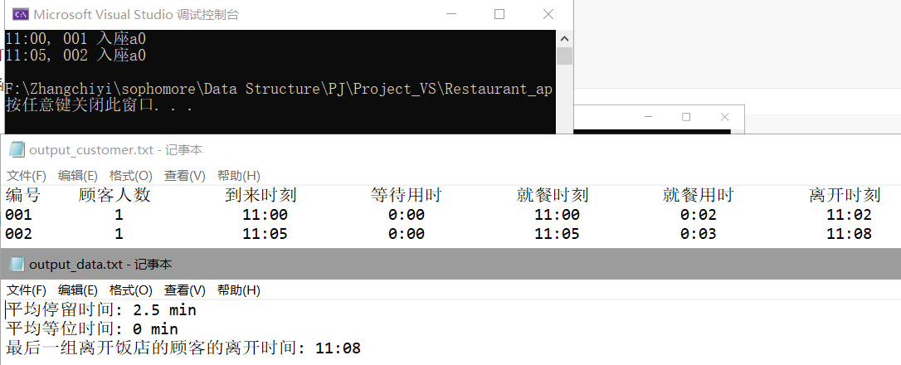


#### input_customer2

```
3 22:21 0:14
1 16:45 0:21
4 19:20 0:01
4 00:08 0:12
0
```

​	这组数据测试的主要目的是判断到达时间的分类，要区先后的时间顺序，把00:08排到最后。

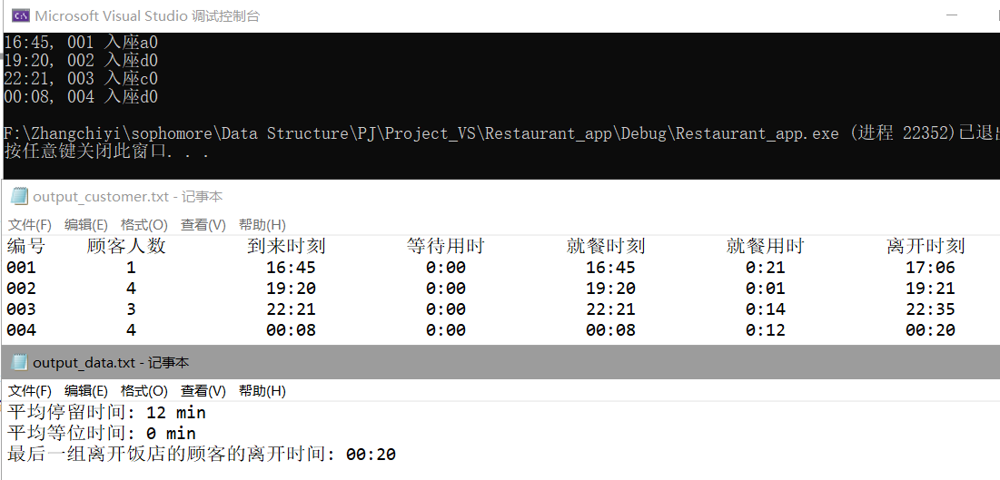


#### input_customer4

```
2 11:00 0:07
2 11:01 0:07
2 11:01 0:07
2 11:01 0:07
2 11:01 0:07
2 11:02 0:07
2 11:01 0:07
2 11:01 0:07
2 11:02 0:07
1 11:03 0:03
0
```

​	首先，这组数据展现了2人桌满，3、4人桌有空余时，饭店应安排2人组顾客入座3人桌、4人桌。

​	更重要的是，这组数据对应了一个极端的情况，1人组顾客到来时，有3组2人组顾客在等待，2、3、4人桌皆无空位，但是1人桌的空位是有的，所以1人组顾客应当可以直接前往1人桌。这种情况对应的是dine()函数，用非递归方法解决。

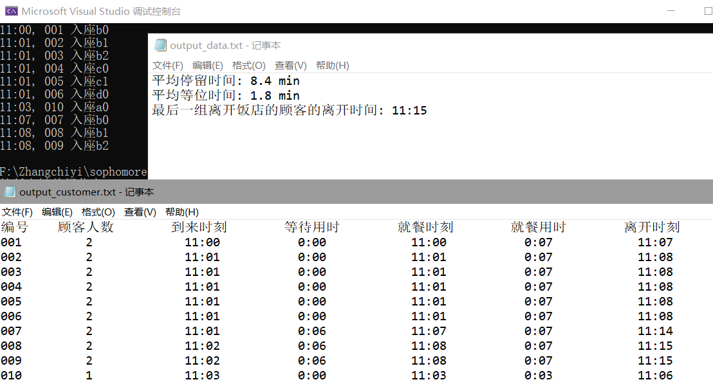


#### input_customer5

```
3 22:21 0:14
1 16:45 0:21
4 19:20 0:01
4 00:08 0:12
1 15:39 0:26
3 21:32 0:10
4 19:03 0:24
1 17:28 0:04
3 13:05 0:07
1 20:49 0:10
...
0
```

​	利用main.cpp中的randin函数，随机生成300个顾客数据（详见input_customer5.txt）。

​	因为随机生成的过程中，顾客人数分布是均匀的，但abcd桌的分布是不均匀的（1人桌4个，2人桌3个，3人桌2个，4人桌1个），导致了后来的顾客4人组要等上很久。比如下面这样7点等到11点半是真的顶。对于一个容量只有20（$4*1+3*2+2*3+1*4$）人的小店，750（300组，每组的期望是2.5人）的日流水确实是有些多了。额外设计中有对此优化：[接客限定](#1.自定义桌位可承接客人组——已完成)。


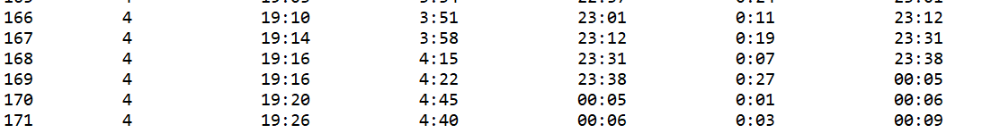

输出概览：

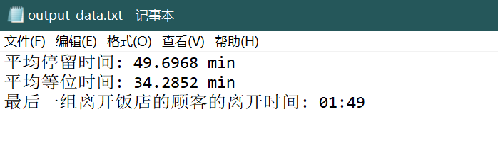

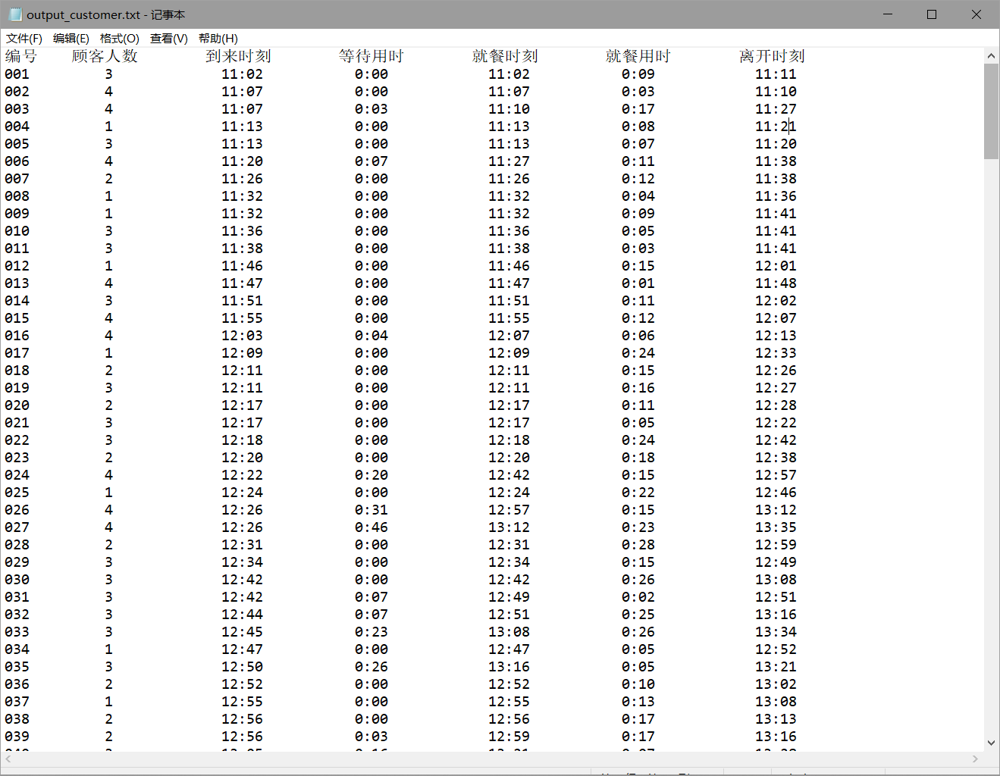


#### input_customer6

```
...
3 01:15 0:03
3 01:15 0:29
3 01:18 0:24
1 01:19 0:16
3 01:20 0:13
4 01:20 0:21
3 01:23 0:19
3 01:29 0:16
...
```

​	这是随机过程中出现的一组有特色的数据，共200组顾客输入，这里仅列举了到达时间在01:00之后的顾客组，详细数据见input_customer6.txt。

​	饭店打烊之前，等位区仍然有很多顾客在等待，所以打烊的时候，并非所有组顾客都吃上了饭。

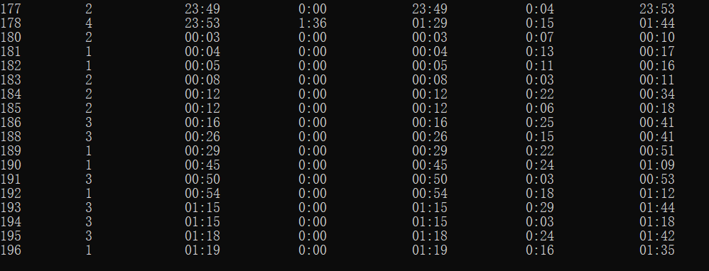

​	输入200组顾客，最后输出编号从001到196，很可惜，1:20以后的四组都没吃上饭

```
3 01:20 0:13
4 01:20 0:21
3 01:23 0:19
3 01:29 0:16
```


### 2）时间复杂度分析

​	这里仅讨论基础功能的时间复杂度.

​	记顾客组数为N，饭店总桌数为m。m远小于N。

​	记每天营运时间为T分钟

#### 1.初始化restaurant:

​	复杂度来源是将数据从input_customer中读，写到wait_section中，每一次写入都会进行priority_queue的排序，总体而言是对规模为N的数据输入进行了一次堆排序，时间复杂度为**O(NlogN)**.

​	读入table的量m远小于N，可以忽略不计，赋予id是遍历wait_section，复杂度为**O(N)**.

​	由加法原则初始化过程的时间复杂度为**O(NlogN)**.

##### update_table_avail

​	遍历所有table，对每个table更新状态，复杂度为**O($m^2$)**

#### 2.用餐dine():

​	最坏情况是所有顾客都挤在一起进入饭店，每一次调用都要遍历等待区所有顾客，寻找是否有顾客可以进入。时间复杂度为O(N)。

​	事实上，这种情况的处理非常僵硬，可以额外添加一个判断，当wait_section中当前时刻在等位的人数大于一定限度后，就停止放号。对应现实情况为，等位人数过多，不再发放号码牌。但是由于输入是一下子把一天中所有顾客都输入的，不太符合常理，所以这里实现起来比较麻烦，暂时不予实现。按实际情况，应当是一组组顾客按时间顺序读入，如此实现等位人数限度非常方便。

​	一般的，首位顾客正常用餐，时间复杂度为O(1).

​	平均复杂度的计算比较复杂，重点是分析不同时刻等位顾客数量的期望值，要考虑到饭店桌位规模（不仅是m，还有不同人数桌子的数量稠密度等），饭店营运时间，日流量规模（不仅是N，还有顾客到来时间与饭店营运时间的关系，一般的，在用餐时段正态分布），平均用餐时间等。

​	平均时间复杂度的具体分析非常复杂，这里不多做拓展。

#### 3.总体main函数的复杂度分析:

​	从starttime到endtime共计T分钟(在这个事例中T = 870)，一共进行了T轮循环。

​	主要时间复杂度来源是循环内步骤，update_table_avail加上dine，最坏情况下时间复杂度为O($m^2 + NlogN$)，总体时间复杂度为**$O(T(m^2+NlogN))$.**


### 3）对模块产生问题的思考

#### 1.resclock与时间格式的显示

​	本来是想直接用标准库的time_t型的作为时间，但因为是小项目，不需要这么高的精度。而且饭店的时间范围也十分“特殊”，所以就自己做了个数据类型，可以让23:19 < 0:20成立，看起来非常舒适。在实现的过程中也学到了不少函数的重载，还有每次计算之后要对原来数据的更新。

比如input_ customer_bug1中的数据曾导致了这样的一个输出，出现了负数的输出

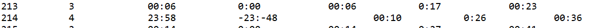

问题来自table中的sitin函数，对于waitperiod的计算涉及到了两个resclock量的相减，在这里是直接调用底层int current相减，没有考虑到会有凌晨时间-正常时间=负数的情况，在这里额外增加了一步，先加上1440（24*60），再%1440，直接地解决。


#### 2.dine()中优先级队列遍历的思考

对于input_customer5的调试中一度出现了这样的问题：

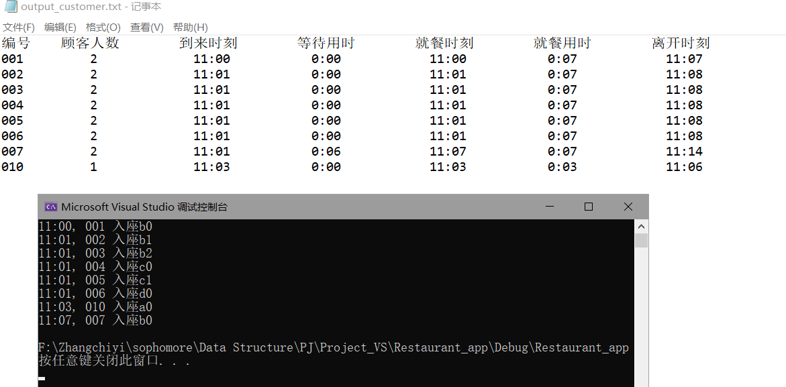

有几个数据神秘失踪了！

调试的时候慢慢发现是dine()中wait_section的恢复出了问题，当可用顾客不是在wait_section的前两位时，就会吃掉一些顾客，非常恐怖。

遍历优先级队列属实是一件不太方便的事情，可以用支持随机访问的堆来解决调用，可以利用标准库的multiset来替代这里的priority_queue。

项目中在赋予id【Restaurant初始化】和寻找可用顾客【Restaurant::dine()】这两个地方用到了遍历wait_section，毕竟所用之处不多，尚可以接受。


### 4）额外设计

#### 1.自定义桌位可承接客人组——已完成

**描述**：

​	像外婆家那样，对于不同的桌子叫号，四个人只能做四人桌，两个人只能坐两人桌，即使有空的四人桌也不行。推广：k人桌可以承接的顾客组是用户自定义的，默认为k以下的组都可以。比如，饭店只有2人桌和4人桌，老板可以修订为，1人组和2人组去二人桌，3人组和4人组去四人桌，不接待超过四人的桌。

**设计思路**：

​	在基础设计时就考虑了这一接口，先设计了int Restaurant::specific_available(int k)，功能为遍历tables[k-1]，如果存在一桌座位可用，就可用座位的号码,否则返回-1。

​	int Restaurant::available(int k)的实现是建立在specific_available的基础上的，功能为存在m>=k，使得m人桌可用，返回m，否则返回0。

```c++
int Restaurant::specific_available(int k)	//遍历tables[k-1]，如果存在一桌座位可用，就可用座位的号码,否则返回-1
{
	if (k <= 0)	return -1;	//对于0人桌，肯定是没有的

	typedef vector<table>::size_type vecsize;
	vecsize siz = tables[k - 1].size();
	for (vecsize i = 0; i < siz; i++)
	{
		if (tables[k - 1][i].available())
			return i;
	}
	return -1;
}
```

**原设计**：	

​	对于k人组的顾客组，用available(k)来找到他们应该入座的桌规模(m人桌，m>=k)，再用specific_available(m)找到对应桌的桌号。

```c++
int Restaurant::available(int k)	//存在m>=k，使得m人桌可用，返回m，否则返回0。
{	//k<=0时，情况同k = 1。
	for (int i = k; i <= MAX_VOLUME; i++)
	{
		if (specific_available(i) != -1)
			return i;
	}
	return 0;
}
```

**进阶设计**：

​	由于四人桌的紧销性，四人组顾客要排很久，我们要求四人桌只能承接四人组顾客。也即：1人组只能到1、2、3人桌，2人组只能到2、3人桌，3人组只能到3人桌，4人组只能到4人桌。

```c++
int Restaurant::available(int k)	//存在m>=k，使得m人桌可用，返回m，否则返回0。
{	//k<=0时，情况同k = 1。

	//4人组只能去4人桌
	if (k == MAX_VOLUME)
		if (specific_available(k) != -1)
			return k;
		else return 0;
	else //其他组不能去4人桌
	{
		for (int i = k; i <= MAX_VOLUME - 1; i++)
		{
			if (specific_available(i) != -1)
				return i;
		}
		return 0;
	}
}
```

​	用新设计对于[input_customer5](#input_customer5)重新测试：

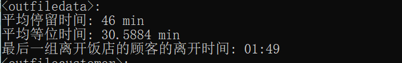

​	平均等位时间降到了30.5884min。

​	当然，这需要具体问题具体分析，应对不同的场景，设置不同的位置对应策略。

​	按照一般连锁餐馆的分组策略，这里以外婆家为例，分为2人的A桌，4人的B桌，6人的C桌和8人的D桌，1人组和2人组只能去A桌，3人组和4人组（也许5人组也许）只能去B桌，5人组和6人组去C桌，7人组和8人组去D桌。

​	自定义操作只需要重定义int Restaurant::available(int k)，略做修改即可。

#### 2.VIP桌——半完成

​	在基本功能的基础上可以再开发一些特定的桌子，平常不开放，如果进入的是特殊顾客（比如特别需要帮助的人群，比如VIP），就直接进入该桌。或者也可以作为包场桌用。

​	在customer_info中添加一项私有成员bool vip; 输入时增加该项，计算传递输出时也都加上。

​	在tables初始化时额外申请一行空间，tables大小为MAX_VOLUME + 1，tables[MAX_VOLUME]作为vip桌。

​	在Restuarant中增加一项wait_section_vip，初始化时根据customer_info的vip标签判断进入wait_section还是wait_section_vip.

​	每次dine()时，增加一项对wait_section_vip的考察，二者并行不悖。

​	具体实现待之后有空了写。

#### 3.预约——待完成

​	开放预约功能，在输入中新增预约行为时间，将到来时刻视作预约到来时刻。（这个应该比较好实现，就直接把他们的预约到来时刻当做到来时刻就可以，这里把现场排队和预约的优先度保持一致）。

​	更进一步的推广——不守约行为：预约的人也有到来时刻，如果到来时刻在预约到来时刻之前，而没有人，可以直接就餐（记得取消预约）；如果到来时刻在预约时刻t分钟之后还没来，就视作放弃预约（或者还有个等三桌？）。还可以将这些不守约用户输出出来，列入黑名单（或者累计三次再列）。

#### 4.拼桌——待完成

​	开放拼桌选项。如果A、B两组顾客都接受拼桌，且当前正在就餐的A组桌子足够容纳B组顾客，那么B组可以加入A组所在的桌子（桌子的预计就餐时间更新）。

## 五、课程设计总结

自顶向下，逐步求精的设计思想。

## 六、参考资料

看看Chrome7天前的历史记录